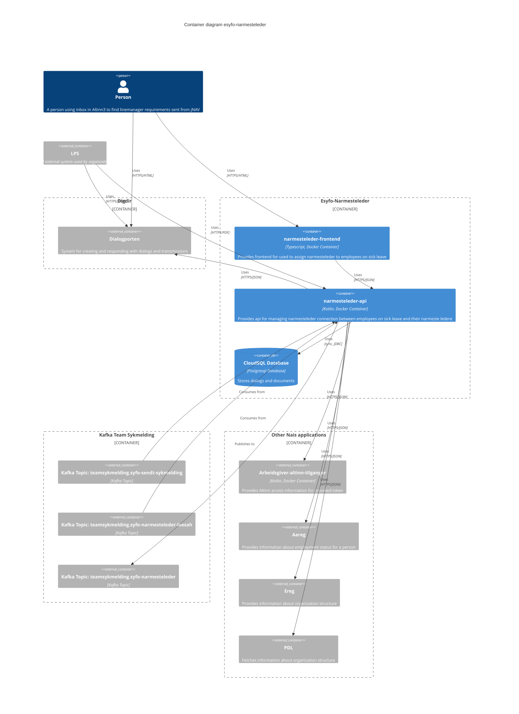

# Syfo-esyfo-narmesteleder

[](https://github.com/navikt/esyfo-narmesteleder/actions/workflows/build-and-deploy.yaml)

[](https://kotlinlang.org/)
[](https://ktor.io/)
[](https://www.postgresql.org/)
[](https://kafka.apache.org/g/)


## Environments

[🚀 Productions internal](https://narmesteleder-api.intern.nav.no)   

[🚀 Productions external](https://narmesteleder-api.nav.no)

[🛠️ Development internal](https://narmesteleder-api.intern.dev.nav.no)

[🛠️ Development external](https://narmesteleder-api.ekstern.dev.nav.no)


## OpenAPI
The OpenAPI specification for the API is available at https://narmesteleder-api.nav.no/swagger

## Overview
This is the repository for narmesteleder-api, a service that provides an API for managing narmesteleder connection between
employees on sick leave and their narmeste ledere.

It identifies when an employee has a need to be assigned a narmeste leder from their employer.
It will communicate this need to the employer by creating a dialog in Altinn Dialogporten,
that will contain an url endpoints that can be used with GET to retrieve details about person on sick leave, and PUT to assign narmesteleder to the employee.


## Diagrams
An always up-to-date diagram can be views in the excellent service from [Flex Arkitektur](https://flex-arkitektur.nav.no/?apper=prod-gcp.team-esyfo.esyfo-narmesteleder).
### C4 Container diagram


## Running tasks with mise
We use [mise](https://mise.jdx.dev/) to simplify running common tasks.
To run a task, use the command
```bash
mise <task-name>
````

To get a list of available tasks, run
```bash
mise tasks
```

## Linting and formatting is done using [ktlint](https://pinterest.github.io/ktlint/latest/)
Please make sure to run the lint check before pushing code. Best way to ensure this is to add a pre-commit git hook.
You can do this with the mise task
```bash
mise add-lint-check-as-pre-commit-hook 
```
Or manually by running
u
```bash
mise lint
```
If there are any linting errors, you can try to fix them automatically with
```bash
mise format
```

## Docker compose
### Size of container platform
In order to run kafka++ you will probably need to extend the default size of your container platform. (Rancher Desktop, Colima etc.)

Suggestion for Colima
```bash
colima start --arch aarch64 --memory 8 --cpu 4 
```

We have a docker-compose.yml file to run a postgresql database, texas and a fake authserver.
In addition, we have a docker-compose.kafka.yml that will run a kafka broker, schema registry and kafka-io

There are mise tasks to start and stop these environments.
Start them both using
```bash
mise docker-up
```
Stop them all again
```bash
mise docker-down
```
### Kafka-ui
You can use [kafka-ui](http://localhost:9000) to inspect your consumers and topics. You can also publish or read messages on the topics

## Authentication for dev
In order to get a token for annsatt that has access to update narmesteleder relasjon, you can use the following url:
https://tokenx-token-generator.intern.dev.nav.no/api/obo?aud=dev-gcp:team-esyfo:esyfo-narmesteleder

Select "på høyt nivå" and give the ident of a Daglig leder for the organisasjonsnummer you want to test with.

## Running requests locally
There is a [Bruno](https://www.usebruno.com/) collection in the folder [.bruno](./.bruno) that you can open and find request to run against your locally running instance.
Look in the Docs tab of requests for further instructions, when needed.

There is a folder with json files for kafka messages in [local-dev-resources](./local-dev-resources). These can be used from kafka-ui to publish messages to the topics that syfo-esyfo-narmesteleder is consuming.
