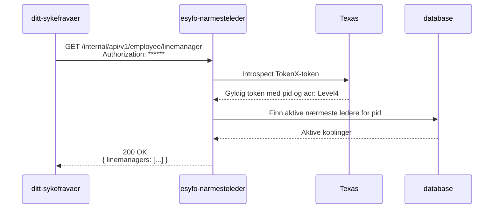

# GET /internal/api/v1/employee/linemanager

Dette interne endepunktet lar en sykmeldt person hente sine aktive nærmeste ledere på tvers av virksomheter. Det erstatter team sykmeldings `GET /user/v2/sykmeldt/narmesteledere` for `ditt-sykefravaer`.

Den normative API-kontrakten ligger i [Swagger](/internal/swagger).

## Sekvensdiagram



## Respons

```json
{
  "linemanagers": [
    {
      "id": "00000000-0000-4000-8000-000000000001",
      "orgNumber": "314560132",
      "activeFrom": "2026-01-15T08:00:00Z",
      "name": {
        "firstName": "Ola",
        "middleName": null,
        "lastName": "Eksempel"
      },
      "emailAddresses": ["leder@example.test"],
      "mobile": "00000000"
    }
  ]
}
```

`emailAddresses` er en liste fordi kildefeltet kan inneholde flere e-postadresser.

## Autentisering

- Endepunktet godtar bare TokenX `UserPrincipal` med `acr: Level4`.
- API-et henter fødselsnummeret fra `pid`-claimen i tokenet.
- Token med ukjent eller ikke støttet issuer gir `401 Unauthorized`. Dette inkluderer Maskinporten.
- API-et gjør ingen Altinn-tilgangssjekk. Brukeren henter bare sine egne koblinger.

## Filtrering

Kun aktive koblinger er med i responsen:

- `aktiv_tom` må være tom.
- `aktiv_fom` kan ikke ligge i fremtiden.

Du kan bruke den valgfrie query-parameteren `orgNumber` for å begrense resultatet til én virksomhet. Orgnummeret må ha ni sifre. Et orgnummer uten treff gir `200 OK` med en tom liste.

Responsen har ingen paginering eller øvre grense for antall koblinger.

## Avvik fra team sykmelding sitt endepunkt

Dette endepunktet returnerer bare aktive koblinger. Det eksponerer ikke fødselsnummer. Det har heller ikke feltene `organisasjonsnavn` og `arbeidsgiverForskutterer`, fordi de ikke finnes i datamodellen.
