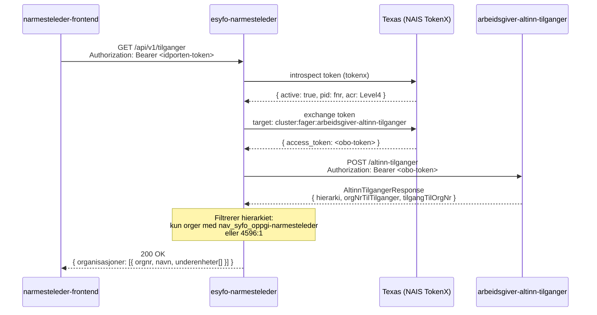

# GET /api/v1/tilganger

Endepunkt som returnerer organisasjoner den innloggede arbeidsgiveren har nærmeste leder-tilgang til. Responsen er kompatibel med [`@navikt/virksomhetsvelger`](https://github.com/navikt/virksomhetsvelger).

## Sekvensdiagram



## Respons

```json
{
  "organisasjoner": [
    {
      "orgnr": "123456789",
      "navn": "Bedrift AS",
      "underenheter": [
        {
          "orgnr": "987654321",
          "navn": "Avdeling Oslo",
          "underenheter": []
        }
      ]
    }
  ]
}
```

## Autentisering

- **TokenX** (idporten) — kun `UserPrincipal` med `acr: Level4`
- Token exchanged via Texas-sidecar mot `arbeidsgiver-altinn-tilganger`

## Filtreringslogikk

En organisasjon inkluderes i responsen dersom:
- Den har Altinn 3-ressursen `nav_syfo_oppgi-narmesteleder`, **eller**
- Den har Altinn 2-tjenesten `4596:1`

Hovedenheter inkluderes også hvis en underenhet har tilgang. Underenheter uten tilgang filtreres bort.
