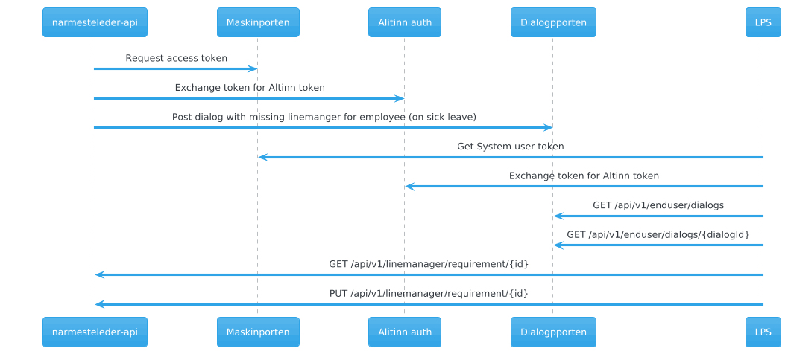

# Assign line manager (Nærmeste leder) from LPS viewpoint
The Nav api will share the need to assign a line manager (nærmeste leder) for an employee with the organization through Dialogporten.
It can be viewed in the Alinn innboks, or fetched by other systems through Dialogporten api.
Dialogporten is a sytestem deleivered by Altinn. Check out their [documentation](https://docs.altinn.studio/nb/dialogporten/reference/openapi/) for more information.

When the dialog is read by api, it contains link to a resource in Nav api to get National Identifier (fødselsnummer) and name of the employee in need of a line manager.



The response from ```GET /api/v1/linemanager/requirement/{id}``` will look like this:
```json
{
  "id": "3ba48bb7-a967-4185-a0e7-c044011be683",
  "employeeIdentificationNumber": "15436803416",
  "orgnumber": "215649202",
  "orgName": "The Ghostbusters",
  "mainOrgnumber": "310667633",
  "managerIdentificationNumber": null,
  "name": {
    "firstName": "Egon",
    "lastName": "Spengler",
    "middleName": null
  }
}
```

Once the lps as determined who should be the line manager for the employee, it can be assigned through
```PUT /api/v1/linemanager/requirement/{id}``` with body:
```json
{
  "nationalIdentificationNumber": "13468329780",
  "mobile": "12345678",
  "email": "peter.venkman@ghostbusters.com"
}
```
