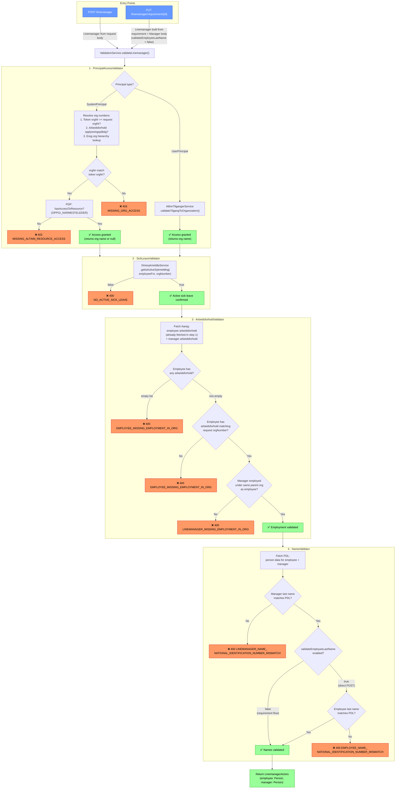

# validateLinemanager — Validation Flow

This diagram shows the validation pipeline executed by `ValidationService.validateLinemanager()`,
called from two routes: `POST /linemanager` and `PUT /linemanager/requirement/{id}`.

## Validators summary

| # | Validator | External service | Error types |
|---|-----------|-----------------|-------------|
| 1 | `PrincipalAccessValidator` | Altinn Tilganger, PDP, Ereg | `MISSING_ORG_ACCESS`, `MISSING_ALTINN_RESOURCE_ACCESS` |
| 2 | `SickLeaveValidator` | Dine Sykmeldte | `NO_ACTIVE_SICK_LEAVE` |
| 3 | `ArbeidsforholdValidator` | Aareg | `EMPLOYEE_MISSING_EMPLOYMENT_IN_ORG`, `LINEMANAGER_MISSING_EMPLOYMENT_IN_ORG` |
| 4 | `NameValidator` | PDL | `LINEMANAGER_NAME_NATIONAL_IDENTIFICATION_NUMBER_MISMATCH`, `EMPLOYEE_NAME_NATIONAL_IDENTIFICATION_NUMBER_MISMATCH` |

## Key differences between entry points

| | `POST /linemanager` | `PUT /linemanager/requirement/{id}` |
|---|---|---|
| Source of `Linemanager` | Request body | Built from stored requirement + `Manager` body |
| `validateEmployeeLastName` | `true` | `false` (employee already identified by requirement) |
